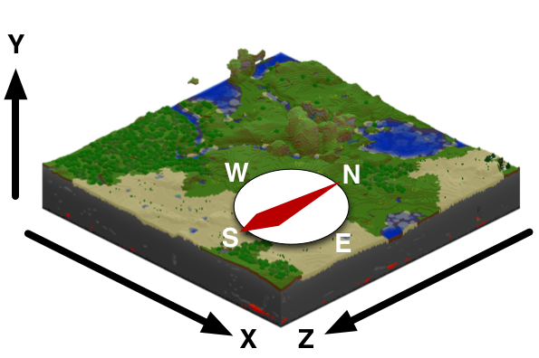
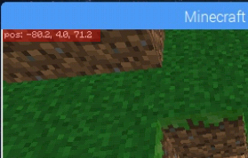

# A Small Extension to [MCPI](https://github.com/martinohanlon/mcpi) for the Raspberry Pi
[MCPI repository](https://github.com/martinohanlon/mcpi#minecraft-pi-edition-api-python-library)

[Stuff about code]( https://www.stuffaboutcode.com/p/minecraft-api-reference.html ) is also a very good resource


The goal of this repository is to add some additional functions to make placing blocks that are either directional or color variable i.e. doors or wool.

## Documentation with Example Code

### (X, Y, Z) Coordinate System

Minecraft uses an (x,y,z) coordinate system, x determines east/west positioning, y determines height (unusually), and z determine north/south positioning.





We can access the position of our character with the following:
```python
me.x
me.y
me.z
```



Our players coordinates are just variables and we can do math with and to them.
```python
me.x+5
me.y-3
me.z+6
```

### Single Block
```python
mc.setBlock(x, y, z, block_id)
```
Where block_id is  the name of a block in [block_ids.txt](block_ids.txt)
```python3
# Example
mc.setBlock(me.x, me.y, me.z, block.AIR.id)
```


### Solid Rectangular Prism
```python
mc.setBlocks(me.x, me.y, me.z, me.x+10, me.y+10, me.z, block_id)
```
Spans a retangular prism of the type block.id from a list of the block ids in [block_ids.txt](block_ids.txt) between the first and second (x,y,z) coordinate triples.
```python
mc.setBlocks(me.x, me.y, me.z, me.x+10, me.y+10, me.z, block.DIAMOND_BLOCK.id)
```
### Hollow Cube

```python
cube(mc, distX, distY, distZ, x, y, z, material)
```
This function is kinda buggy. Spawns a cube in the specified game instance, with specified interior distances at the (x,y,z) coordinate triple of the specifed material.

### Doors

```python
woodDoor(mc, x, y, z)
```
Places a wood door in the specified game instance at the (x,y,z) coordinate triple.
```python
ironDoor(mc, x, y, z)
```
Places an iron door in the specified game instance at the (x,y,z) coordinate triple.

### Beds

```python
bed(mc, x, y, z, orientation)
```
Places a bed in the specified game instance at the (x,y,z) coordinate triple. Orientation is a number {1, 2, 3, 4} that controls the orientation of the bed.

### Colored Wool

```python
mc.setBlock(x, y, z, block.WOOL.id, COLOR)
```
Where COLOR can be any of the following: **white**, **orange**, **magenta**, **light_blue**, **yellow**, **lime**, **pink**, **grey**, **light_grey**, **cyan**, **purple**, **blue**, **brown**, **green**, **red**, **black**.

### Wood

```python
mc.setBlock(x, y, z, block.WOOD.id, TYPE)
```
Where TYPE can be any of the following: **oak**, **spruce**, **birch**.

### Sapling

```python
mc.setBlock(x, y, z, block.SAPLING.id, TYPE)
```
Where TYPE can be any one of the following: **oak**, **spruce**, **birch**.

### Tall Grass
```python
mc.setBlock(x, y, z, block.GRASS_TALL.id, TYPE)
```
Where TYPE can be any one of the following: **shurb**, **grass**, **fern**.

### Stone Brick
```python
mc.setBlock(x, y, z, block.STONE_BRICK.id, TYPE)
```
Where TYPE can be any one of the following: **stone**, **mossy**, **cracked**, **chiseled**.

### Stone Slab
```python
mc.setBlock(x, y, z, block.STONE_SLAB.id, TYPE)
```
Where TYPE can be any one of the following: **stone**, **sandstone**, **wooden**, **cobblestone**, **brick**, **stone_brick**.

### TNT
```python
mc.setBlock(x, y, z, block.TNT.id, TYPE)
```
Where TYPE can be any one of the following: **inactive**, **active**.

Both blocks look the same, however the active TNT block will explode when hit.

### Leaves
```python
mc.setBlock(x, y, z, block.LEAVES.id, TYPE)
```
Where TYPE can be any one of the following: **oak**, **spruce**, **birch**.

### Sandstone
```python
mc.setBlock(x, y, z, block.STANDSTONE.id, TYPE)
```
Where TYPE can be any one of the following: **chiseled**, **smooth**.

### Stairs

```python
mc.setBlock(x, y, z, block.STAIRS_WOOD.id, TYPE)
mc.setBlock(x, y, z, block.STAIRS_COBBLESTONE.id, TYPE)
```
Where TYPE can be any one of the following: **east**, **west**, **south**, **north**, **ueast**, **uwest**, **usouth**, **unorth**.

Where the "u" stands for upside down.

### Chests and Furnaces
```python
mc.setBlock(x, y, z, block.FURNACE_ACTIVE.id, TYPE)
mc.setBlock(x, y, z, block.FURNACE_INACTIVE.id, TYPE)
```
Where TYPE can be any one of the following: **fnorth**, **fsouth**, **fwest**, **feast**.

### Neather Reactor Core
```python
mc.setBlock(x, y, z, block.NEATHER_REACTOR_CORE.id, TYPE)
```
Where TYPE can be any one of the following: **unused**, **active**, **inactive**.

### Sample House

```python
sample_house(mc, x, y ,z)
```
Places a sample_house in the specified game instance at an (x,y,z) coordinate triple.

### Other Useful Functions
Print messages to the games chat
```python
mc.postToChat("Hello, world!")
```

Make a save point
```python
mc.saveCheckPoint()
```

Restore last save point
```python
mc.restoreCheckpoint()
```

Happy coding! :octocat:
